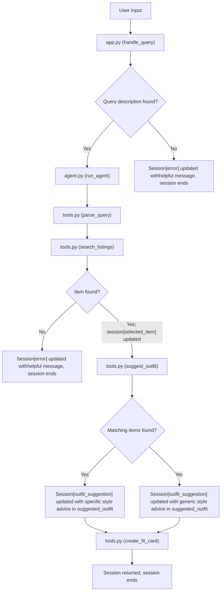

# FitFindr — planning.md

> Complete this document before writing any implementation code.
> Your spec and agent diagram are what you'll use to direct AI tools (Claude, Copilot, etc.) to generate your implementation — the more specific they are, the more useful the generated code will be.
> Your planning.md will be reviewed as part of your submission.
> Update it before starting any stretch features.

---

## Tools

List every tool your agent will use. For each tool, fill in all four fields.
You must have at least 3 tools. The three required tools are listed — add any additional tools below them.

### Tool 1: search_listings

**What it does:**

<!-- Describe what this tool does in 1–2 sentences -->

This tool searches the listings in the database to find the closest item in the database to the specified item that has the exact specified size and a price below max price. To find the closest item, it would be best to use the fields description, category, and style tags.

**Input parameters:**

<!-- List each parameter, its type, and what it represents -->

- `description` (str): A description of the desired item
- `size` (str): The size that the potential option should be
- `max_price` (float): The maximum price of a potential option

**What it returns:**

<!-- Describe the return value — what fields does a result contain? -->

A list of dictionaries where each item has the fields contains the title, the price, the platform, and condition of the item.

**What happens if it fails or returns nothing:**

<!-- What should the agent do if no listings match? -->

If there's no matches, the agent should say that there's no match, and prompt the user to look for something else.

---

### Tool 2: suggest_outfit

**What it does:**

<!-- Describe what this tool does in 1–2 sentences -->

This tool searches the given wardrobe to find items that can be paired with the specified item to create an outfit.

**Input parameters:**

<!-- List each parameter, its type, and what it represents -->

- `new_item` (dict): The specified item the user is trying to create an outfit with
- `wardrobe` (dict): The potential items that can be paired with the specified item

**What it returns:**

<!-- Describe the return value -->

Returns a string that contains the complementary items to the specified item as well as a description of the vibe of all the items put together in an outfit.

**What happens if it fails or returns nothing:**

<!-- What should the agent do if the wardrobe is empty or no outfit can be suggested? -->

If the wardrobe is empty, then the LLM should just output general styling advice.

If the wardrobe is non-empty, but there's suggested outfit, then prompt the user to ask about another item.

##

### Tool 3: create_fit_card

**What it does:**

<!-- Describe what this tool does in 1–2 sentences -->

This tool creates a postable caption about the outfit suggestion for a new item they just purchased, and an observation of how the items in the suggestion flatter each other.

**Input parameters:**

<!-- List each parameter, its type, and what it represents -->

- `outfit` (string): The outfit pairing from suggestion
- `new_item` (dict): The new item that was purchased

**What it returns:**

<!-- Describe the return value -->

A string that represents the caption of the post

**What happens if it fails or returns nothing:**

<!-- What should the agent do if the outfit data is incomplete? -->

If there is no listing or no outfit, then the agent should fallback with the respective messages to the user for each tool. As in no additional calls should be made if there's an error preceding them.

---

### Additional Tools (if any)

<!-- Copy the block above for any tools beyond the required three -->

### Tool 1: parseQuery()

**What it does:**

<!-- Describe what this tool does in 1–2 sentences -->

This tool parses the query into a dict so that i can be seamlessly passed into search listings.

**Input parameters:**

<!-- List each parameter, its type, and what it represents -->

- `query` (str): The user query looking for an item

**What it returns:**

<!-- Describe the return value — what fields does a result contain? -->

A dictionary with key values description, size, and price (max price). The values are only sourced from the query, and if they are not present, then they are given a value of "None" for json formatting.

**What happens if it fails or returns nothing:**
The only thing that would cause it to fail is if the LLm returned "None" because I handle that case explicitly in the prompt. Downstream, that app.py will flag it as an error and return a helpful message.

---

## Planning Loop

**How does your agent decide which tool to call next?**

<!-- Describe the logic your planning loop uses. What does it look at? What conditions change its behavior? How does it know when it's done? -->

The user first has to specify an item. The agent can only call search listings once the user has identified an item.

If search listings returns an empty list, then the agent responds with a helpful message to the user about asking about a different item, an error is flagged, and the session ends.

If an item is found, the agent calls suggest outfit. The tool always returns an outfit it's just either generic or detailed, and create fit card will always be called at this point.

The tool returns the caption, and the session ends.

---

## State Management

**How does information from one tool get passed to the next?**

<!-- Describe how your agent stores and accesses state within a session. What data is tracked? How is it passed between tool calls? -->

The data is tracked via the new session function that creates a dict with keys corresponding to the fields that will get updated during the session.

The fields that are tracked include: query, parsed (parsed query), search_results, selected_item, wardrobe , outfit_suggestion, fit_card", and "error".

It gets passed between tool calls when the agent calls the tool. This is where the agent will have to check to make sure that field is not None before calling a tool that requires that field to have a value.

## Error Handling

For each tool, describe the specific failure mode you're handling and what the agent does in response.

| Tool            | Failure mode                          | Agent response         |
| --------------- | ------------------------------------- | ---------------------- |
| search_listings | No results match the query            | Please provide another |
|                 |                                       | item to search.        |
| suggest_outfit  | Wardrobe is empty                     | No outfit pairing      |
| create_fit_card | Outfit input is missing or incomplete | Won't be called        |

---

## Architecture

<!-- Draw a diagram of your agent showing how the components connect:
     User input → Planning Loop → Tools (search_listings, suggest_outfit, create_fit_card)
                                                                          ↕
                                                                   State / Session
     Show what triggers each tool, how state flows between them, and where error paths branch off.
     ASCII art, a Mermaid diagram (https://mermaid.js.org/syntax/flowchart.html), or an embedded
     sketch are all fine. You'll share this diagram with an AI tool when asking it to implement
     the planning loop and each individual tool. -->

---

## AI Tool Plan

<!-- For each part of the implementation below, describe:
     - Which AI tool you plan to use (Claude, Copilot, ChatGPT, etc.)
     - What you'll give it as input (which sections of this planning.md, your agent diagram)
     - What you expect it to produce
     - How you'll verify the output matches your spec before moving on

     "I'll use AI to help me code" is not a plan.
     "I'll give Claude my Tool 1 spec (inputs, return value, failure mode) and ask it to implement
     search_listings() using load_listings() from the data loader — then test it against 3 queries
     before trusting it" is a plan. -->

**Milestone 3 — Individual tool implementations:**
I am looking to build up my coding skills, so I will attempt to code. Test a couple example, and then I will do a more extensive debug with AI generated tests by giving Claude my tool specs (each tool heading under the Tools section). If this lasts more than hour (per tool), then I will prompt the AI to either help me with bugs or provide hints on better implementation approaches.

**Milestone 4 — Planning loop and state management:**
Same as Milestone 3

---

## A Complete Interaction (Step by Step)

Write out what a full user interaction looks like from start to finish — tool call by tool call. Use a specific example query.

**Example user query:** "I'm looking for a vintage graphic tee under $30. I mostly wear baggy jeans and chunky sneakers. What's out there and how would I style it?"

**Step 1:**

<!-- What does the agent do first? Which tool is called? With what input? -->

When it comes to finding a new item, the agent should call the search listings tool. The agent should make sure that there is always a new item provided. If not, prompt the user to specify an item.

If the additional fields max price and size are not provided, there is not filter applied to the results. Since the user didn't specify, we can assume all sizes and sizes are plausible.

The agent will then call the search listings tool to find the specified item from listings with "vintage graphic tee" as the desired item and $30 as max price.

**Step 2:**

<!-- What happens next? What was returned from step 1? What tool is called now? -->

If there are no matching items, the tool returns an empty list.

If the returned output is empty, the agent should flag the error field, produce a helpful message, and exit the session early.

If there is a matching listing, a list with the search results as dicts are returned.

The agent then calls the outfit suggestion tool with the first item in the returned output as the selected item in addition to the provided wardrobe from the session.

**Step 3:**

<!-- Continue until the full interaction is complete -->

If there is an empty wardrobe, or no matching outfits, then the tool should output generic styling tips in string format.

If there is a match, a string with the suggested outfit to the user is returned.

Then, create fit card is called with the suggested outfit and the selected item.

**Final output to user:**
The final output is a postable caption.

<!-- What does the user actually see at the end? -->

The user sees a postable caption for their specified new item and suggested outfit.
